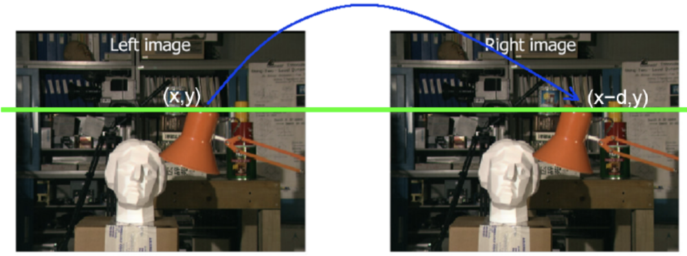

# Loopy-Belief-Propagation
This repo contains the implementation of Loopy-belief-propagation algorithm for Stereo Matching.  
The goal is to compute disparity between an image and a slightly moved copy of it (a camera movement): a `left-right stereo image pair`.  
Which leads to an estimation of the depths of pixels.

